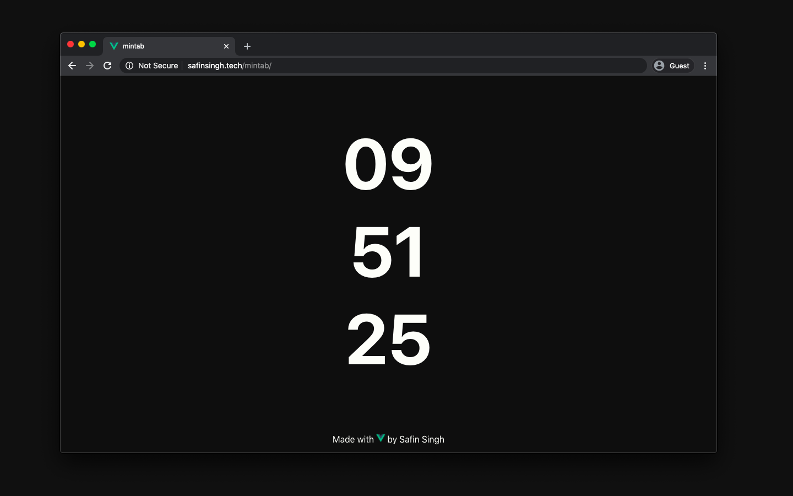

<h1 align="center">
    mintab
</h1>

<h3 align="center">
    <i>
      A minimalist new <a href="https://safinsingh.tech/mintab">tab</a> for Chromium made with Vue
    </i>
</h3>

  
  
  
  
  
  

## ✨ In Action

## 👨‍💻 Author

Linkedin: [Safin Singh](https://www.linkedin.com/in/safin-singh-b2630918a/)  
GitHub: [safinsingh](https://github.com/safinsingh)  
Dribbble: [Safin Singh](https://dribbble.com/safinsingh/)  
YouTube: [Safin Singh](https://www.youtube.com/channel/UCvb01sUdAgcPAG1j0SLxAtA)

## 🤝 Contributing

Contributions, PRs, issues and feature requests are welcome! Feel free to check out our [issues page](https://github.com/safinsingh/raPID/issues).

## ❤️ Show your support

Give a ⭐️ if this project helped you!
Hope you enjoy it!

_Under the MIT License, you may NOT use this template in your own projects_
